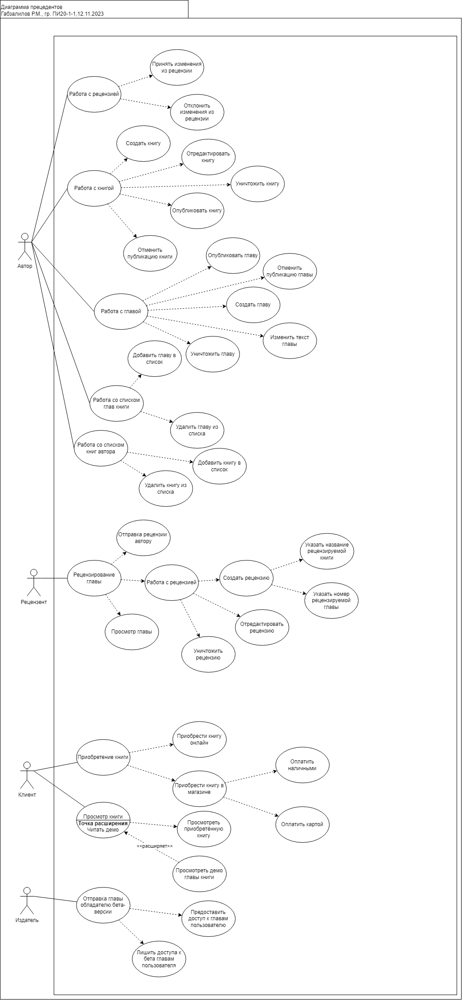

# PAPS
Лабораторная работа №1
Вариант 1
# Перечень заинтересованных лиц (стейкхолдеров) с краткими описаниями 
Стейкхолдеры
- Издатель. Он обладает магазином, продающим книги.
- Банк благодаря которому будут производиться денежные переводы
# Перечень функциональных требований 
Исходя из требований и некоторых предположений можно сформулировать следующие функциональные требования:
- Публикация глав или книг
- Отмена публикации книг или глав
- Загрузка в систему глав в виде сканов напечатанных вариантов, либо набор текста книг
- Рецензирование книг
- Просмотр книг 
- Принятие или отклонение рецензий
- Хранение электронных вариантов загруженных книг
- Покупка книг в электронном виде
- Покупка книг в твёрдом переплёте
- Покупка в электронном виде бета версий книг
- Покупка в электронном виде бета версий глав
- Оплата книг денежным переводом или наличными
# Диаграмма вариантов использования для функциональных требований

# Перечень сделанных предположений 
- Скорее всего у Издателя сейчас есть единственный способ распространять доступ к своим книгам и информации о его магазине, это его магазин.
- Один и тот же человек может выступать в сразу нескольких ролях
- Поскольку клиент приобретает книги, а рецензент их рецензирует и может бесплатно просматривать, нужно ограничить возможности рецензента по злоупотреблению таким положением, обязав его рецензировать прочитанное или каким-либо другим способом.
- Клиент должен иметь доступ только к приобретенным главам и книгам
- Автор по доступу к книгам должен отличаться от клиента только полным доступом к своим книгам и главам.
- Издатель имеет доступ ко всем книгам издательства и только на прочтение потому что его управлением над содержимым книг может быть рецензирование
- Бета доступ связан с издателем и соответственно означает доступ к бета версиям связанных с ним книг
- Главы входят в книгу и соответственно публиковать книгу тоже нужно
- Поскольку важно хранить информацию о пользователях, нужно организовать авторизацию в системе. Для этого можно установить, что пользователь может обладать несколькими ролями, чтобы не нужно было делать очень много пользовательских аккаунтов.
- Возможно, поскольку любой пользователь должен иметь возможность купить книгу просто потому что он - человек, можно сделать права клиентов присущими всем. То есть не прописывать эту роль в системе.