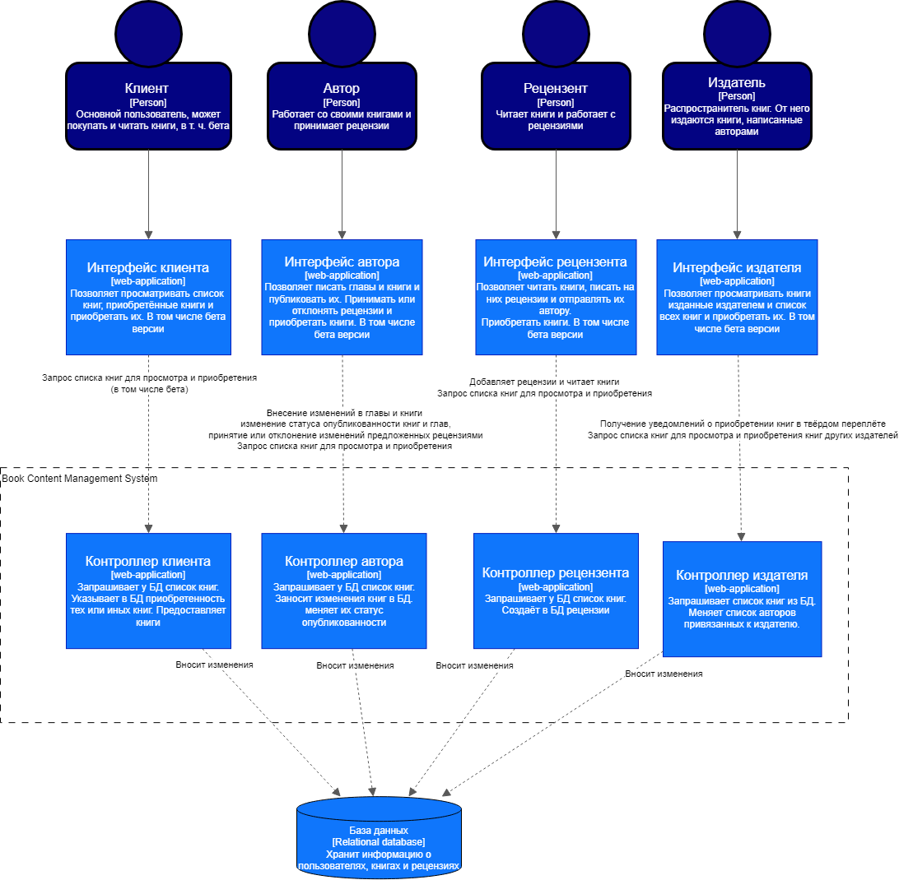
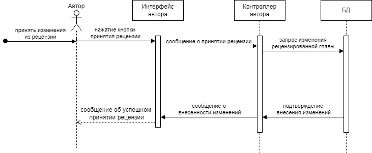
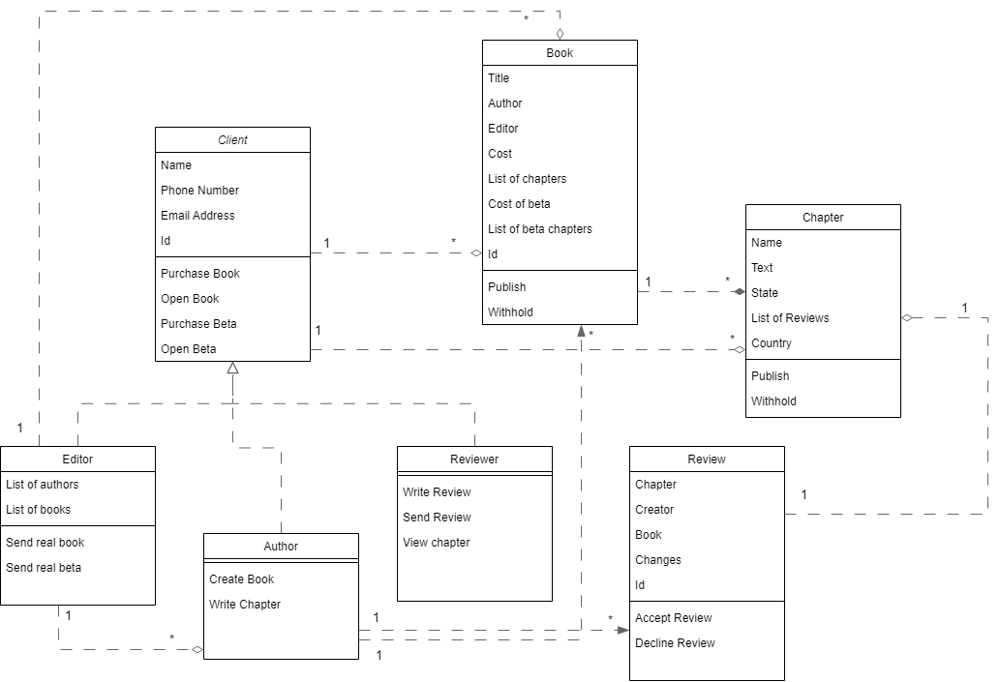

# Лабораторная работа №3
Тема: Использование принципов проектирования на уровне методов и классов
Цель работы: Получить опыт проектирования и реализации модулей с использованием принципов KISS, YAGNI, DRY и SOLID.

# Диаграмма компонентов
Из интерфейсов управляющее возздействие пользователя идёт к контроллеру соответствующему роли пользователя который получает введенные в некоторые поля данные или контекст некоторой кнопки и выполняет соответствующее действие над данными БД.

# Диаграмма последовательностей
ДП для выбранного варианта использования - Принять изменения из рецензии.

Автор в интерфейсе использует соответствующую кнопку, интерфейс сообщает это контроллеру который обращается к БД чтобы изменить книгу так как предлагает рецензия.

# Модель БД
Поскольку предполагается что пользователи всех ролей должны иметь возможность приобретать книги, все роли наследуются от роли клиент. Реценззенты на прямую не связаны с рецензиями поскольку они будут писать рецензии до того как их отправить и до того как они будут отправлены они не будут существовать в БД, а только локально.

Предполагается, что ассоциация автора с книгой и сильная связь книги с главами обозначает что автор имеет доступ к управлению собственными главами.
